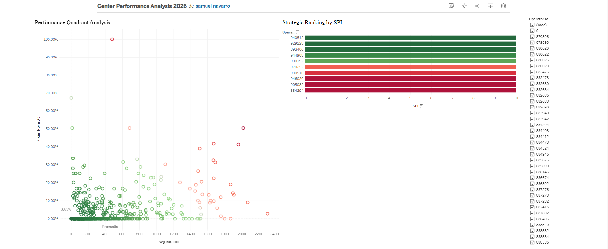

# Call Center Performance & Efficiency Analysis 📞📊

[🚀 View Interactive Dashboard on Tableau Public](https://public.tableau.com/app/profile/samuel.navarro3503/viz/CenterPerformanceAnalysis2026/Dashboard1)

---

## 🖼️ Analysis Preview
Here is a snapshot of the final 4-Quadrant Scatter Plot used to segment agent performance:

---

## Project Overview
This repository contains an end-to-end data analysis workflow designed to identify operational bottlenecks in a call center environment. The core objective was to segment agent performance by correlating productivity (SPI) with customer retention (Inbound Abandonment Rate).

## Business Logic & Methodology
Instead of looking at isolated metrics, I implemented a **4-Quadrant Performance Matrix** to categorize operators:
* **High Performers:** High SPI / Low Abandonment.
* **Underperformers:** Low SPI / High Abandonment (Priority for training).
* **Efficiency Traps:** High SPI but high abandonment (Potential burnout or technical issues).

## Technical Toolkit
* **Data Pre-processing:** Python (**Pandas, NumPy**) used for handling missing values, data type conversion, and KPI engineering.
* **Data Visualization:** **Tableau Desktop** (Calculated fields, Set Actions, and Dual-Axis Scatter Plots).
* **Language Proficiency:** English (C1 Level) documentation and technical reporting.

## Repository Structure
* `*.ipynb`: The Jupyter Notebook containing the full **Exploratory Data Analysis (EDA)** and cleaning process.
* `*.twbx`: The packaged Tableau Workbook (requires Tableau Desktop/Reader to open).
* `*.csv`: The raw and processed datasets used for the analysis.

---
*Developed as part of a Professional Data Analytics Portfolio.*
